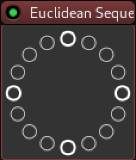
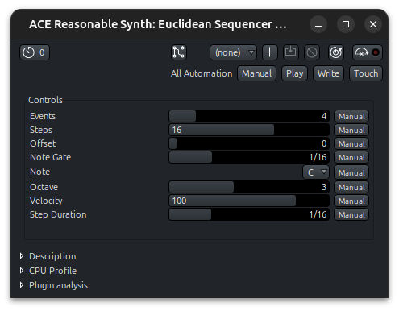

[](https://github.com/kassoulet/ardour-euclidean-sequencer/actions/workflows/main.yml)

# Euclidean Sequencer for Ardour

A Simple, Monophonic, Euclidean Sequencer for Ardour8.

1. Choose the number of steps and the number of hits.
2. Choose the midi note.
3. Enjoy!





## Installation

Install just. See https://github.com/casey/just

```sh
just
```
Or run the following command:

```sh
cp -v euclidean_sequencer.lua ~/.config/ardour8/scripts/
```

## History

### 0.2
- Add step duration
- Rename *Note Duration* to *Note Gate*
- Fix issue with negative notes at the beginning

### 0.1
- First verson

---
## Todo

1.0
- ~~tempo multiplier~~
- presets
- test tempo slides

- multiple sequences?
- sequence operators?
